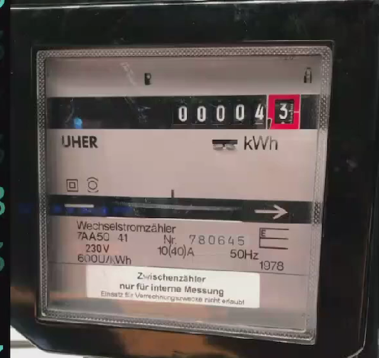
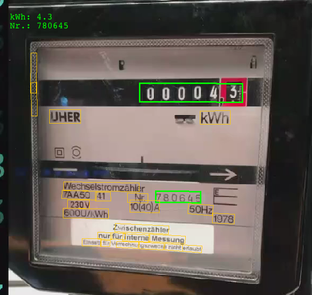

# Meter Reading with SAP Leonardo

At this [demo](https://labs.cx.sap.com/2018/10/30/meter-reading/) a photo is send to SAP Leonardo to read the consumption and also the serial number (to identify the user).

I want to try, if this is possible and took a screenshot at ~2:06 to used this image to call the [Inference Service for Scene Text Recognition](https://api.sap.com/api/scene_text_recognition_api/overview):

The scene text recognition finds text and bounding boxes. Every number with six or more characters are highlighted in green. The first value is the consumption and the second the serial number. The scene text recognition service doesn't order it and therefore the value with the lower y-position is the consumption:

To run this application you need an API key and the Inference Service for Scene Text Recognition SDK.